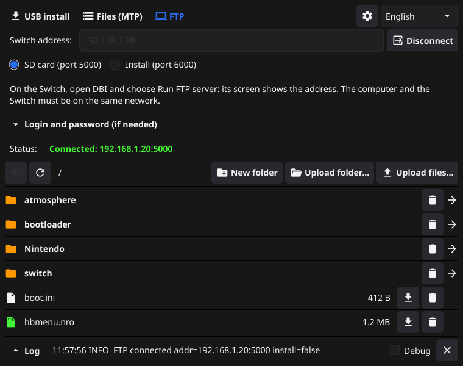
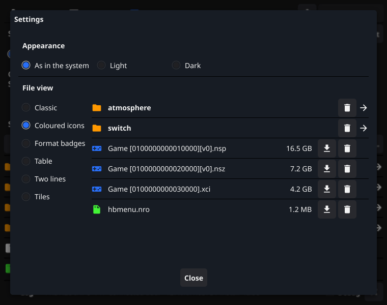

# DBI Backend (Go)

[English](README.md) | [Русский](README.ru.md) | [Español](README.es.md) | [Italiano](README.it.md) | [Deutsch](README.de.md) | **Français** | [Português](README.pt.md) | [中文](README.zh.md) | [日本語](README.ja.md) | [हिन्दी](README.hi.md) | [العربية](README.ar.md)

Une application de bureau pour installer des jeux par USB sur une Nintendo Switch équipée de [DBI](https://github.com/rashevskyv/dbi). Choisissez un dossier contenant des fichiers `.nsp` / `.nsz` / `.xci`, branchez la Switch et lancez l’installation.

C’est une réécriture en Go de [lunixoid/dbibackend](https://github.com/lunixoid/dbibackend) (un script Python), avec une interface graphique, des versions prêtes à l’emploi pour macOS et Windows, et sans Python ni libusb à installer.


## Fonctionnalités

- **Interface graphique** : choix du dossier (Finder, Explorateur ou glisser-déposer), liste des fichiers trouvés avec leur taille, état de la connexion, barre de progression avec vitesse de transfert, et panneau de journal commun à tous les onglets. Le panneau est réduit à sa dernière ligne ; dépliez-le quand vous en avez besoin.
- **Aucun redémarrage** : quand DBI a terminé, l’application attend de nouveau la Switch. Le dernier dossier est mémorisé ; l’installation commence lorsque vous cliquez sur **Démarrer**.
- **11 langues** : anglais, russe, espagnol, italien, allemand, français, portugais, chinois, japonais, hindi et arabe. La langue suit celle du système et peut être changée dans la fenêtre.
- **Pilote Windows intégré** : lorsque l’application détecte la Switch sans pilote, elle propose de l’installer. Cela remplace l’étape manuelle avec Zadig (voir ci-dessous).
- **Fichiers via MTP sous macOS et Linux** : parcourez les stockages de la Switch, envoyez des fichiers et des dossiers entiers, téléchargez et supprimez des fichiers, sans Android File Transfer (voir ci-dessous).
- **Fichiers via FTP sur tous les systèmes** : connectez-vous au serveur FTP de DBI en Wi-Fi, sans câble, pour gérer la carte SD ou installer des jeux (voir ci-dessous).
- **Paramètres** : apparence claire ou sombre, et six styles d’affichage des fichiers pour les onglets MTP et FTP.
- **Mode ligne de commande** (`-cli`), qui se comporte comme le script d’origine, pour l’automatisation.
- **Plus sûr que l’original** : la Switch ne peut demander que des fichiers du dossier choisi.

## Téléchargement

Les versions prêtes à l’emploi se trouvent sur la page [Releases](../../releases).

| Système | Fichier | Remarques |
|---|---|---|
| macOS 12+ (Apple Silicon et Intel) | `DBI Backend.app` | Non signée avec un certificat de développeur Apple. Au premier lancement : clic droit → **Ouvrir**, ou exécutez `xattr -dr com.apple.quarantine "DBI Backend.app"`. |
| Windows 10/11 (x64 et ARM64) | `DBI Backend.exe` | Un seul fichier, rien d’autre à installer. Le pilote USB s’installe depuis l’application (voir ci-dessous). |
| Linux | compilation depuis les sources | Voir [Compilation](#compilation). |

## Utilisation

1. Lancez l’application, choisissez le dossier contenant vos jeux (les sous-dossiers sont inclus) et cliquez sur **Démarrer**.
2. Sur la Switch, ouvrez DBI et choisissez **Install title from USB**.
3. Branchez la Switch à l’ordinateur avec un câble USB. L’état passe à **Connecté**.
4. Sélectionnez les fichiers dans DBI et installez-les. La progression et la vitesse s’affichent en bas de la fenêtre.

## Windows : pilote USB

Sous Windows, l’application ne peut communiquer avec la Switch que via le pilote WinUSB. Auparavant, il fallait l’installer à la main avec [Zadig](https://zadig.akeo.ie/).

Désormais, l’application s’en charge elle-même. Lorsqu’elle détecte la Switch sans pilote, elle affiche une invite : cliquez sur **Installer** et acceptez la demande d’administrateur de Windows. Vous pouvez aussi utiliser à tout moment le bouton **Installer le pilote USB** de la fenêtre. La Switch doit être branchée et DBI doit être en mode **Install title from USB**.

Fonctionnement : l’application attribue le pilote WinUSB fourni avec Windows et signé par Microsoft (comme **Mettre à jour le pilote → Choisir parmi une liste… → WinUsb Device** dans le Gestionnaire de périphériques). Elle n’ajoute aucun certificat au système et fonctionne même lorsque le Contrôle intelligent des applications est activé.

## Fichiers via MTP (macOS et Linux)

macOS ne prend pas en charge MTP nativement : la Switch n’apparaît donc pas dans le Finder lorsque DBI est en mode MTP, et Android File Transfer, la solution habituelle, n’est plus mis à jour. L’onglet **Fichiers (MTP)** le remplace :

1. Sur la Switch, ouvrez DBI et choisissez **Run MTP responder**, puis branchez le câble.
2. Dans l’application, ouvrez l’onglet **Fichiers (MTP)** et cliquez sur **Connecter**.
3. Choisissez un stockage (carte SD, NAND, cibles d’installation, sauvegardes, etc.), ouvrez les dossiers et envoyez des fichiers et des dossiers avec **Envoyer des fichiers…** et **Envoyer un dossier…** ou en les faisant glisser sur la fenêtre. Vous pouvez aussi télécharger et supprimer des fichiers, et créer des dossiers.

Pour installer un jeu, envoyez-le vers un stockage dont le nom contient « install » : DBI l’installe au fur et à mesure de sa réception. Les fichiers de plus de 4 Go sont pris en charge.

**Un dossier envoyé est fusionné** avec le dossier du même nom sur la Switch (la casse n’a pas d’importance) : les fichiers portant le même nom sont remplacés, et tout le reste sur la Switch est conservé. Les fichiers techniques comme `.DS_Store` sont ignorés. Vers les stockages d’installation, seuls les fichiers sont envoyés, sans les dossiers.


**« La Switch est utilisée par un autre programme. »** Sous macOS, le service caméra du système (`ptpcamerad`) s’empare des appareils MTP dès leur branchement. Cliquez sur **Libérer l’appareil** : l’application arrête le service et prend la Switch ; macOS relance le service de lui-même lorsqu’il en a besoin. Android File Transfer bloque aussi l’appareil : quittez-le d’abord.

Sous Windows, l’onglet est masqué : l’Explorateur de fichiers affiche déjà la Switch en mode MTP.

## Fichiers via FTP (tous les systèmes)

DBI peut lancer un serveur FTP en Wi-Fi. L’onglet **FTP** s’y connecte et offre le même gestionnaire de fichiers que l’onglet MTP, y compris l’envoi de dossiers :

1. Sur la Switch, ouvrez DBI et choisissez **Run FTP server**. L’adresse de la Switch s’affiche à l’écran.
2. Dans l’application, ouvrez l’onglet **FTP**, saisissez l’adresse, choisissez le mode et cliquez sur **Connecter** :
   - **Carte SD (port 5000)** : parcourez la carte SD, envoyez des fichiers et des dossiers, téléchargez et supprimez des fichiers, créez des dossiers ;
   - **Installation (port 6000)** : envoyez des jeux pour les installer.

L’ordinateur et la Switch doivent être sur le même réseau. Le serveur de DBI ne demande pas de mot de passe ; si vous en avez défini un, saisissez-le dans **Identifiant et mot de passe**. En Wi-Fi, les transferts sont généralement plus lents qu’en USB.



## Paramètres

Le bouton ⚙ à côté du choix de la langue ouvre les paramètres :

- **Apparence** : comme le système, clair ou sombre.
- **Affichage des fichiers** pour les onglets MTP et FTP : classique, icônes colorées, badges de format, tableau, deux lignes ou mosaïque. Un aperçu montre chaque style.

Quel que soit le style, un clic droit sur un fichier ou un dossier ouvre un menu avec les actions disponibles.



## Linux

Autorisez l’accès à la Switch sans root en installant la règle udev (elle couvre les deux modes : installation USB et MTP) :

```bash
sudo cp data/linux/99-dbibackend.rules /etc/udev/rules.d/
sudo udevadm control --reload-rules
```

Si l’onglet **Fichiers (MTP)** indique que la Switch est utilisée par un autre programme, l’environnement de bureau l’a peut-être montée de lui-même (gvfs) : démontez-la dans le gestionnaire de fichiers.

## Vitesse de transfert

La vitesse est surtout limitée par la Switch, pas par l’ordinateur :

- En **USB 2.0**, le plafond est d’environ **40 Mo/s**. Avec des fichiers `.nsp` / `.xci` non compressés, l’application occupe le bus environ 80 % du temps et atteint en moyenne environ 32 Mo/s.
- Les **fichiers `.nsz`** s’installent environ trois fois plus lentement : la Switch décompresse elle-même chaque bloc.
- DBI demande les données par morceaux de 1 Mo maximum et ne demande le morceau suivant qu’après avoir traité le précédent. L’ordinateur ne peut pas accélérer cela.

À la fin de chaque session, le journal affiche une ligne `Session stats` :

| Champ | Signification |
|---|---|
| `usb_MB/s` | Vitesse pendant l’envoi des données |
| `avg_MB/s` | Vitesse moyenne entre la première et la dernière requête |
| `time_data` / `time_handshake` / `waiting_for_switch` | Part du temps consacrée à l’envoi des données, aux échanges du protocole et à l’attente de la Switch |
| `active` / `idle` | Durée de l’installation, et temps d’inactivité avant et après |

Si `waiting_for_switch` est élevé, le goulot d’étranglement est la Switch (vitesse d’écriture de la microSD, décompression NSZ). Avec **Débogage** activé (dans le panneau du journal), celui-ci affiche chaque requête de DBI avec sa taille et sa vitesse.

## Mode ligne de commande

```bash
dbibackend -cli ~/Switch          # wait for the Switch, serve one session, exit
dbibackend -cli -debug ~/Switch   # the same with a detailed log
dbibackend ~/Switch               # open the window with this folder
dbibackend -install-driver        # Windows: install the WinUSB driver for the connected Switch
```

Sous macOS, le serveur peut démarrer automatiquement au branchement de la Switch : modifiez le chemin dans `data/darwin/com.dbibackend.usb.agent.plist` et copiez ce fichier dans `~/Library/LaunchAgents/`.

## Compilation

Il vous faut Go 1.25+ et un compilateur C (cgo est requis par libusb et Fyne).

```bash
# macOS
brew install libusb pkg-config
# Debian/Ubuntu (plus the Fyne dependencies: https://docs.fyne.io/started/)
sudo apt install libusb-1.0-0-dev pkg-config

make build        # ./dbibackend for the current system
make test         # tests
make release      # dist/DBI Backend.app and dist/DBI Backend.exe
```

`make release` s’exécute sous macOS. Cette commande compile libusb depuis les sources et la lie statiquement : le résultat ne nécessite aucune installation supplémentaire. La version Windows requiert en outre `brew install mingw-w64` et l’outil `fyne` (`go install fyne.io/tools/cmd/fyne@latest`).

## Structure du projet

| Paquet | Rôle |
|---|---|
| `dbi` | Protocole DBI0 (LIST / FILE_RANGE / EXIT), analyse du dossier, statistiques de session |
| `usbconn` | Ouverture de la Switch via libusb (gousb) en modes installation USB et MTP, transferts bulk |
| `mtp` | Client MTP (PTP sur USB) : stockages, dossiers, envoi et téléchargement, fichiers de plus de 4 Go |
| `gui` | Interface Fyne, client FTP |
| `i18n` | Traductions (`i18n/locales/*.json`) |
| `winusb` | Installation de WinUSB sous Windows (SetupAPI) |
| `cmd/winusb-helper` | Utilitaire natif Windows ARM64 pour l’installation du pilote |

Pour ajouter ou corriger une traduction, modifiez `i18n/locales/<code>.json`. `go test ./i18n/` vérifie que chaque langue contient toutes les clés.

## Différences avec l’original

- La Switch ne peut demander que des fichiers du dossier choisi. L’original ouvrait n’importe quel chemin envoyé par l’appareil.
- Le filtre d’extensions est corrigé : l’original reconnaissait `nsz` sans le point.
- Si des fichiers de sous-dossiers différents portent le même nom, c’est le premier trouvé qui est utilisé (DBI ne voit que les noms de fichiers).

## Remerciements et licences

- **Ce projet** : [MIT](LICENSE).
- [lunixoid/dbibackend](https://github.com/lunixoid/dbibackend) (MIT) : l’implémentation originale du protocole.
- [DBI](https://github.com/rashevskyv/dbi) par duckbill : l’installateur sur la Switch.
- [libusb](https://libusb.info/) (LGPL-2.1) est liée statiquement dans les versions compilées. Le code source de ce projet est ouvert : vous pouvez donc le recompiler avec votre propre version de libusb.
- [Fyne](https://fyne.io/) (BSD-3-Clause), [gousb](https://github.com/google/gousb) (Apache-2.0), [zenity](https://github.com/ncruces/zenity) (MIT), [jlaffaye/ftp](https://github.com/jlaffaye/ftp) (ISC).

Ce projet n’est pas affilié à Nintendo. N’installez que des jeux que vous possédez.
