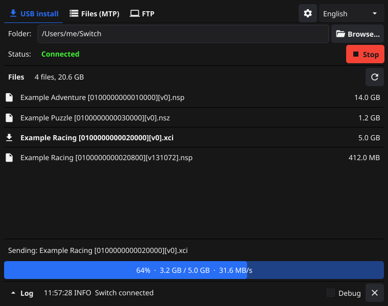
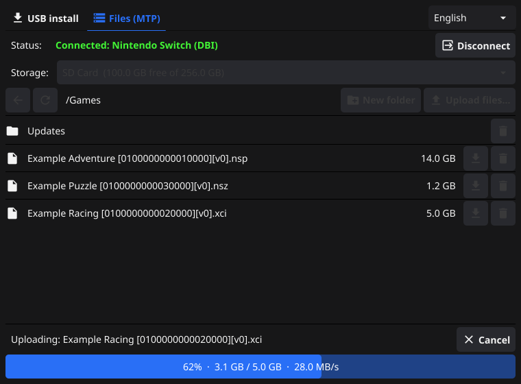

# DBI Backend (Go)

**English** | [Русский](README.ru.md) | [Español](README.es.md) | [Italiano](README.it.md) | [Deutsch](README.de.md) | [Français](README.fr.md) | [Português](README.pt.md) | [中文](README.zh.md) | [日本語](README.ja.md) | [हिन्दी](README.hi.md) | [العربية](README.ar.md)

A desktop app for installing games onto a Nintendo Switch running [DBI](https://github.com/rashevskyv/dbi) over USB. Pick a folder with `.nsp` / `.nsz` / `.xci` files, connect the Switch, and install.

It is a Go rewrite of [lunixoid/dbibackend](https://github.com/lunixoid/dbibackend) (a Python script) with a graphical interface, ready-made builds for macOS and Windows, and no Python or libusb to install.



## Features

- **Graphical interface**: folder picker (Finder, Explorer, or drag and drop), list of found files with sizes, connection status, progress bar with transfer speed, and a log.
- **No restarts**: after DBI finishes, the app waits for the Switch again. The last folder is remembered, and the server starts automatically on launch.
- **11 languages**: English, Russian, Spanish, Italian, German, French, Portuguese, Chinese, Japanese, Hindi, and Arabic. The language follows the system and can be changed in the window.
- **Windows driver built in**: when the app sees the Switch without a driver, it offers to install it. This replaces the manual Zadig step (see below).
- **Files over MTP on macOS and Linux**: browse the Switch's storages, upload, download and delete files, without Android File Transfer (see below).
- **Command-line mode** (`-cli`) that behaves like the original script, for automation.
- **Safer than the original**: the Switch can only request files from the chosen folder.

## Download

Ready-made builds are on the [Releases](../../releases) page.

| System | File | Notes |
|---|---|---|
| macOS 12+ (Apple Silicon and Intel) | `DBI Backend.app` | Not signed with an Apple developer certificate. On first launch: right-click → **Open**, or run `xattr -dr com.apple.quarantine "DBI Backend.app"`. |
| Windows 10/11 (x64 and ARM64) | `DBI Backend.exe` | A single file, nothing else to install. The USB driver is installed from the app (see below). |
| Linux | build from source | See [Building](#building). |

## Usage

1. Start the app and choose the folder with your games. Subfolders are included.
2. On the Switch, open DBI and choose **Install title from USB**.
3. Connect the Switch to the computer with a USB cable. The status changes to **Connected**.
4. Choose the files in DBI and install them. Progress and speed are shown at the bottom of the window.

## Windows: USB driver

On Windows, the app can only talk to the Switch through the WinUSB driver. Previously you had to install it by hand with [Zadig](https://zadig.akeo.ie/).

Now the app does it itself. When it sees the Switch without a driver, it shows a prompt: click **Install** and confirm the Windows administrator request. You can also use the **Install USB driver** button in the window at any time. The Switch must be connected and DBI must be in **Install title from USB** mode.

How it works: the app assigns the WinUSB driver that ships with Windows and is signed by Microsoft (the same as **Update driver → Let me pick → WinUsb Device** in Device Manager). It doesn't add any certificates to the system, and it works with Smart App Control enabled.

## Files over MTP (macOS and Linux)

macOS has no built-in MTP support, so the Switch doesn't appear in Finder when DBI runs its MTP responder, and Android File Transfer, the usual workaround, is no longer updated. The **Files (MTP)** tab replaces it:

1. On the Switch, open DBI and choose **Run MTP responder**, then connect the cable.
2. In the app, open the **Files (MTP)** tab and click **Connect**.
3. Pick a storage (SD card, NAND, install targets, saves and so on), open folders, and upload files with **Upload files…** or by dragging them onto the window. You can also download and delete files and create folders.

To install a game, upload it to a storage with "install" in its name: DBI installs it as it arrives. Files over 4 GB are supported.



**"The Switch is used by another program."** On macOS the system camera service (`ptpcamerad`) grabs MTP devices as soon as they are connected. Click **Free the device**: the app stops the service and takes the Switch; macOS starts the service again on its own when it's needed. Android File Transfer also holds the device, so quit it first.

On Windows the tab is hidden: Explorer already shows the Switch in MTP mode.

## Linux

Allow access to the Switch without root by installing the udev rule (it covers both the USB install and MTP modes):

```bash
sudo cp data/linux/99-dbibackend.rules /etc/udev/rules.d/
sudo udevadm control --reload-rules
```

If the **Files (MTP)** tab reports that the Switch is used by another program, the desktop may have mounted it on its own (gvfs): unmount it in the file manager.

## Transfer speed

The speed is limited mostly by the Switch, not the computer:

- Over **USB 2.0** the ceiling is about **40 MB/s**. On uncompressed `.nsp` / `.xci` files, the app keeps the bus busy about 80% of the time and reaches about 32 MB/s on average.
- **`.nsz` files** install about three times slower: the Switch decompresses every block itself.
- DBI requests data in pieces of up to 1 MB and asks for the next piece only after it has processed the previous one. The computer cannot speed this up.

At the end of every session the log shows a `Session stats` line:

| Field | Meaning |
|---|---|
| `usb_MB/s` | Speed while data is being sent |
| `avg_MB/s` | Average speed from the first request to the last |
| `time_data` / `time_handshake` / `waiting_for_switch` | Share of time spent sending data, on the protocol exchange, and waiting for the Switch |
| `active` / `idle` | Install time and idle time before and after it |

If `waiting_for_switch` is high, the bottleneck is the Switch (microSD write speed, NSZ decompression). With **Debug** enabled, the log shows every DBI request with its size and speed.

## Command-line mode

```bash
dbibackend -cli ~/Switch          # wait for the Switch, serve one session, exit
dbibackend -cli -debug ~/Switch   # the same with a detailed log
dbibackend ~/Switch               # open the window with this folder
dbibackend -install-driver        # Windows: install the WinUSB driver for the connected Switch
```

On macOS, the server can start automatically when the Switch is connected: edit the path in `data/darwin/com.dbibackend.usb.agent.plist` and copy it to `~/Library/LaunchAgents/`.

## Building

You need Go 1.25+ and a C compiler (cgo is required by libusb and Fyne).

```bash
# macOS
brew install libusb pkg-config
# Debian/Ubuntu (plus the Fyne dependencies: https://docs.fyne.io/started/)
sudo apt install libusb-1.0-0-dev pkg-config

make build        # ./dbibackend for the current system
make test         # tests
make release      # dist/DBI Backend.app and dist/DBI Backend.exe
```

`make release` runs on macOS. It builds libusb from source and links it statically, so the result needs nothing installed. The Windows build also needs `brew install mingw-w64` and the `fyne` tool (`go install fyne.io/tools/cmd/fyne@latest`).

## Project structure

| Package | Purpose |
|---|---|
| `dbi` | DBI0 protocol (LIST / FILE_RANGE / EXIT), folder scan, session statistics |
| `usbconn` | Opening the Switch through libusb (gousb) in USB install and MTP modes, bulk transfers |
| `mtp` | MTP client (PTP over USB): storages, folders, upload and download, files over 4 GB |
| `gui` | Fyne interface |
| `i18n` | Translations (`i18n/locales/*.json`) |
| `winusb` | Installing WinUSB on Windows (SetupAPI) |
| `cmd/winusb-helper` | Native ARM64 Windows helper for driver installation |

To add or fix a translation, edit `i18n/locales/<code>.json`. `go test ./i18n/` checks that every language has all the keys.

## Differences from the original

- The Switch can only request files from the chosen folder. The original would open any path the device sent.
- The extension filter is fixed: the original matched `nsz` without the dot.
- If files in different subfolders have the same name, the first one found is used (DBI only sees file names).

## Acknowledgements and licenses

- **This project**: [MIT](LICENSE).
- [lunixoid/dbibackend](https://github.com/lunixoid/dbibackend) (MIT): the original implementation of the protocol.
- [DBI](https://github.com/rashevskyv/dbi) by duckbill: the installer on the Switch.
- [libusb](https://libusb.info/) (LGPL-2.1) is linked statically into the builds. The source code of this project is open, so you can rebuild it with your own version of libusb.
- [Fyne](https://fyne.io/) (BSD-3-Clause), [gousb](https://github.com/google/gousb) (Apache-2.0), [zenity](https://github.com/ncruces/zenity) (MIT).

This project is not affiliated with Nintendo. Install only games you own.
